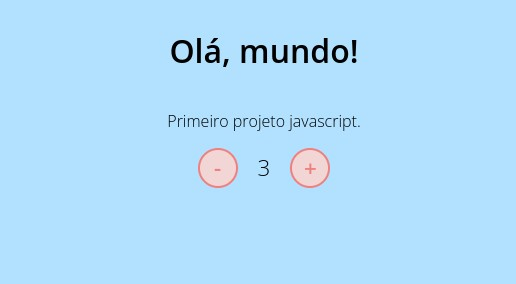

## 🤖 Resultado final

## ✅ Objetivo

- [x] Somar ao clicar em mais
- [x] Subtrair ao clicar em menos
- [x] Treinar manipulação do DOM

## 🚀 Tecnologias utilizadas
- HTML
- CSS
- JavaScript

## 💻 Como rodar

1. Clonar [este projeto](https://github.com/lineavelino/dio-takeblip) usando `git clone https://github.com/lineavelino/dio-takeblip`;
2. Entrar na pasta "introducao-javascript/contador";
3. Abrir o arquivo index para vê-lo em seu browser.